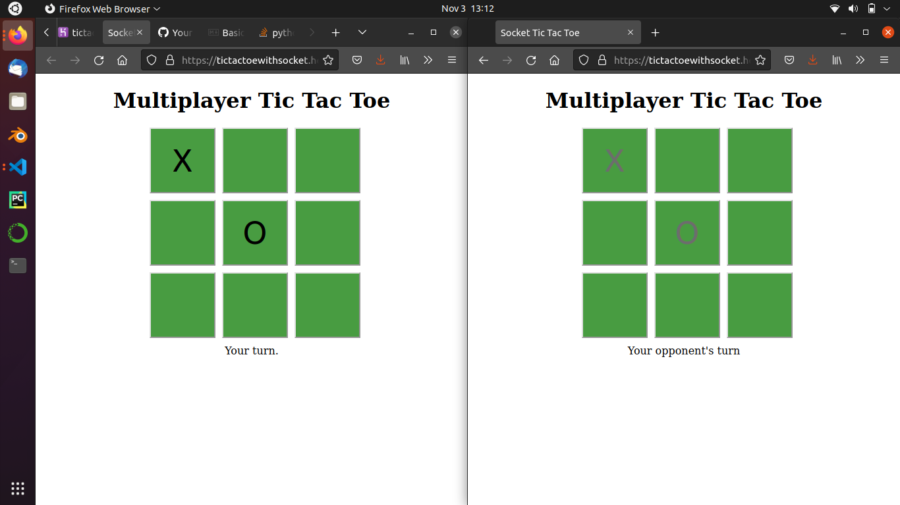
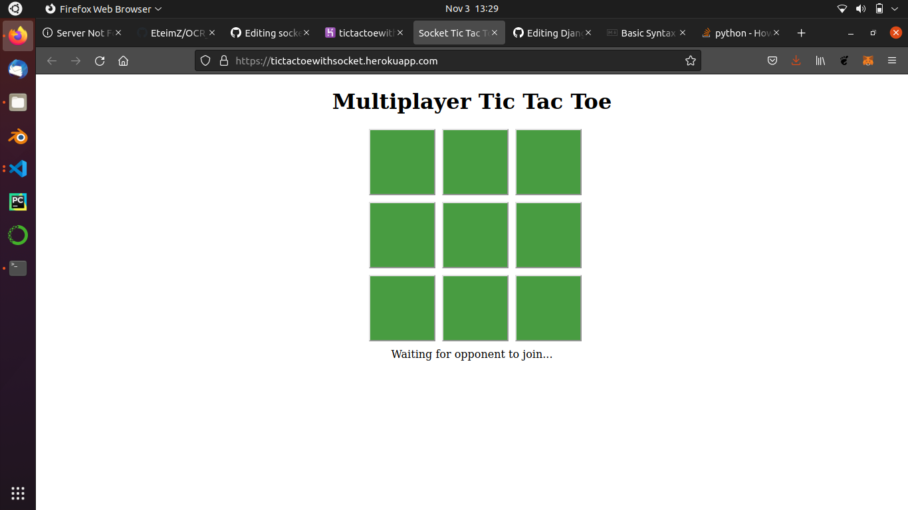
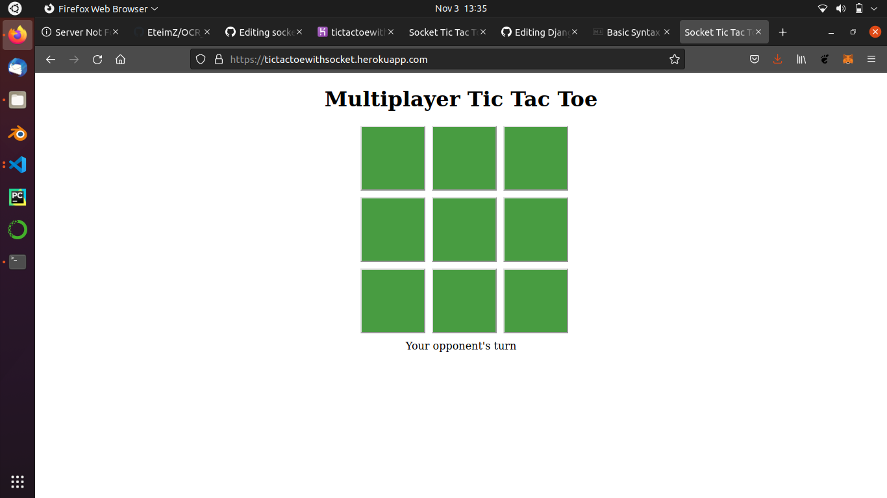

# Socketio tic tac toe



Realtime Tic tac toe built with [socket.io](https://socket.io/) that enables multiplayer over the internet or a local network.

# Usage

Goto https://tictactoewithsocket.herokuapp.com/



You'll be ask to wait for your opponent. Send the link above to a friend or open it in another tab.



A connection will be made between your browser and your opponent's browser.

## Use locally

Follow the steps bellow
```bash
git clone https://github.com/EteimZ/socketio_tic_tac_toe.git
cd socketio_tic_tac_toe
npm start
```

# Resources

Youtube [video](https://www.youtube.com/watch?v=ZjJYqDjmGkI) by [Coding Shiksha](https://www.youtube.com/channel/UCR6d0EiC3G4WA8-Rqji6a8g) and his [repo](https://github.com/gauti123456/MultiplayerTicTacToeSocketio).


